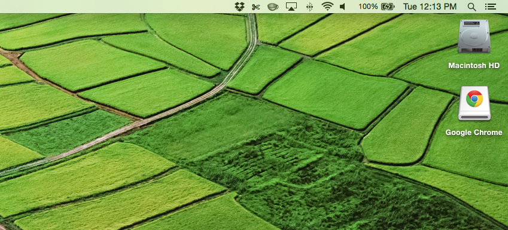

## Applications on a Mac

So.  You're new to this whole Mac thing, and you've been asked to install an application.  Macs do make installs easier, but they also give you a few different options, so you need to know more than one.

### The First Thing to Know

Applications are just files.  They're files with the extension `.app`, and you double-click on them to open them.  Most of the time on a Mac, you don't truly "install" the apps.  You just have a file sitting somewhere on your machine, and you run it.  They don't usually have files spread all over the place like Windows applications.

Another nice side-effect of this approach: to uninstall an application, you just drag it to the trash can.  That's it.

### The Second Thing to Know

If you're a Windows person, you're used to downloading files from the Internet, but you've never *mounted a disk image.*  This is an odd concept, but once you've done it a few times, you get used to it.  (FYI, the "image" in disk image does not mean "photograph" or "picture."  It's a different concept.)

If you download a `.dmg` file from the Internet, that's a disk image (you can see the `d`, `m`, and `g` in "disk image").  When you open it (by double-clicking on it), you're *mounting* it.  It acts just like you plugged a disk drive or flash memory stick into the side of your computer; the Mac thinks it's just another drive.  Your desktop will look something like this:

When you're finished using a `.dmg` installer, you right-click on the icon on your desktop, choose "Eject", and then delete the `.dmg` file in your downloads folder.

### Example 1: Installing Atom

Let's say you download Atom from [the Atom website](https://atom.io/).  Once you do, your downloads folder looks like this:

That's a `.zip` file.  It is a compressed set of files, and it can contain anything.  In this case, it contains a `.app` file.  Double-click on it to extract its contents.  Now you get this:

To install Atom, all you have to do is drag the `Atom.app` file over to the left sidebar where it says "Applications."  That's installing the application.  You're done.

If you want to see all of your installed applications, just click on "Applications" on the left.  You can also see them by clicking on the Launchpad icon down in your dock (it looks like a rocket taking off).

Maybe you want to add it to your dock at the bottom of the screen.  The dock is this thing:

From either the Applications folder or the Launchpad, you can drag an application icon down to the dock and it will stay there.  That'll make it easier for you to open it later.

### Example 2: Installing Chrome

This one's a little different.  Not harder, but different.  When you download Chrome, you don't get a zip file.  You get a `.dmg`:

Double-click on the file and you'll see something like this:

First, note that you've mounted the Chrome disk image.  Great.  Next, note that it brought up an installer window.  This is just Google giving you an easier way to move the `.app` file into your Applications folder.  If you grab the Chrome icon and drag it to the blue Applications folder, under the hood that's **exactly the same** as when you dragged `Atom.app` across.

When you've done this, just close the installer window, eject the disk image, and delete the `.dmg` file you downloaded.

### All the Ways You Can Open Applications

Let's say that you just turned on your computer and you want to run Terminal.  There are lots of ways you can do this:

* **The Dock:** If you've got it in your dock, just click on it!
* **Launchpad:** Click on the Launchpad icon in your dock, then find Terminal on that screen and click on it.  Chances are that it's under Utilities.
* **Finder:** Click on the Finder icon on your dock (the first icon).  Then click on "Applications" in the sidebar, then find Terminal and double-click on it.  Chances are that it's under Utilities.
* **Spotlight:** On your keyboard, hit the `Command` and `Space` keys at the same time.  That'll bring up a little search bar.  Type "Terminal" (or a part of "Terminal") in that box and hit Enter.  Spotlight is a wicked-cool way to open anything from applications to files (to much more).  Play with it when you get a chance to see what it can do.
