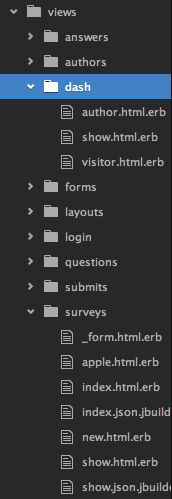

# Week 7 Homework Feedback

## Survey Opossum

We spent a lot of time in class on this one, but here are a few things:

#### Removing files and folders you don't need anymore

It's true that when you have extra files sitting around in Rails, they don't usually hurt anything.  However, they DO make it much harder for developers (including you) to (a) know where you're supposed to be working and (b) find bugs.

Here's an example of a file system that could use a lot of cleaning up:

#### Have a create view!

I saw this sort of controller code come up with three different groups:

    def create
      @submission = Submission.new(submission_params)
      if @submission.save && @submission.survey.author.id == session[:author_id]
        redirect_to @submission, notice: 'Submission was successfully created.'
      elsif @submission.save
        redirect_to thankyou_submissions_path
      else
        redirect_to @submission.survey, notice: "All required questions must be answered."
      end
    end

    def thankyou
    end

In English, it's doing the create work, then (like every other create we've seen) redirecting to a different page.

However, if `thankyou`'s purpose is only to render a thank you view, why have it at all?  Instead, it's better to rename the `thankyou.html.erb` file to `create.html.erb` and just remove the redirect line.  Simpler, better!

#### Complex `reject_if`s

Here's an `accepts_nested_attributes_for` line:

    accepts_nested_attributes_for :questions, allow_destroy: true,
        reject_if: proc { |attributes| attributes['question_text'].blank? },
        reject_if: proc { |attributes| attributes['question_type'].blank? }

I don't think this is doing what the author expected it to do.  Should the question be rejected if the text AND the type are blank, or if either the text OR the type are blank?  I suspect the latter, and this is the better way to write it:

    accepts_nested_attributes_for :questions, allow_destroy: true,
        reject_if: proc { |a| a['question_text'].blank? || a['question_type'].blank? }

## Add JavaScript

#### Set timeouts

As you know from swearing at it last night, if you disable a button in an `onclick` action... that button never has a chance to submit that form.  Like this:

    function disabledButton(){
      var button = document.getElementById("submit-button");
      button.disabled = 'true';;
    }

You've succeeded in disabling the button, but... now you can never edit the information on this page.

It's a bit mind-bending, but the right solution is to put off the disabling of the button for a VERY short amount of time.  This allows the function to finish running, at which time the form will be submitted.  THEN your disabling comes back around and does its thing.  We can make the time delay short enough that the computer can get its work done, but a human could never see it (or be able to double-click).  Here's how you do it:

    function disabledButton(){
      var button = document.getElementById("submit-button");
      setTimeout(function(){ button.disabled = 'true'; }, 1);
    }

This puts off the disabling for 1 millisecond (which is enough).

#### Load order

Sadly, because Rails' JavaScript files load BEFORE the elements on the page load, if you try to run this line of code directly:

    var containers = document.getElementsByClassName("association container");

then `containers` will be empty.  Instead, you have to delay this call until after the page loads, and you can do it by wrapping it in a function and making that function be called when the `window` is finished loading:

    function hideLast(){
      var containers = document.getElementsByClassName("association container");
      containers[containers.length-1].style.display = "none";
    }
    window.onload = hideLast;

#### JavaScript bugs and you

Can you see the bug in this JavaScript code?

    function hideMyField() {
      var sections = document.getElementsByClassName("association container");
      var lastsections = sections[sections.length-1];
        lastsections.color == green
      if(lastsections.style.display === 'block') {
        lastsections.style.display = 'none';
      }
      else{
        lastsections.style.display = 'block';
      }
    }

If you said "wait, I can't find a bug; the indentation's off!", then I salute you.  ;)  The third line should be unindented.  However, the third line is also the problem.  It's expecting there to be a variable called `green`, and there is not.

I bring this up not to fix that bug, but to point out something important about JavaScript bugs in general: they halt execution.  This means that if you don't have your console up, you'll expect the field to be hidden, and nothing will happen.  We could debug the last five lines until the cows come home, but they'll never be run because the control flow never makes it down there.

## Add JQuery

#### Unnecessary escaping

This code works:

    
">

...but putting it in a string is unnecessary.  Just do this:

    
">

#### Unnecessary variable

There was a method last night with the sole purpose of hiding a div.  Here's what it contained:

    var lastLink = $('#last-button').closest(".association.container").hide();

Since everything on the right side of the `=` handled the hiding as was required, there was no need to save the result in a variable.  We never ended up doing anything with `lastLink`.  Here's a better way to write this:

    $('#last-button').closest(".association.container").hide();
